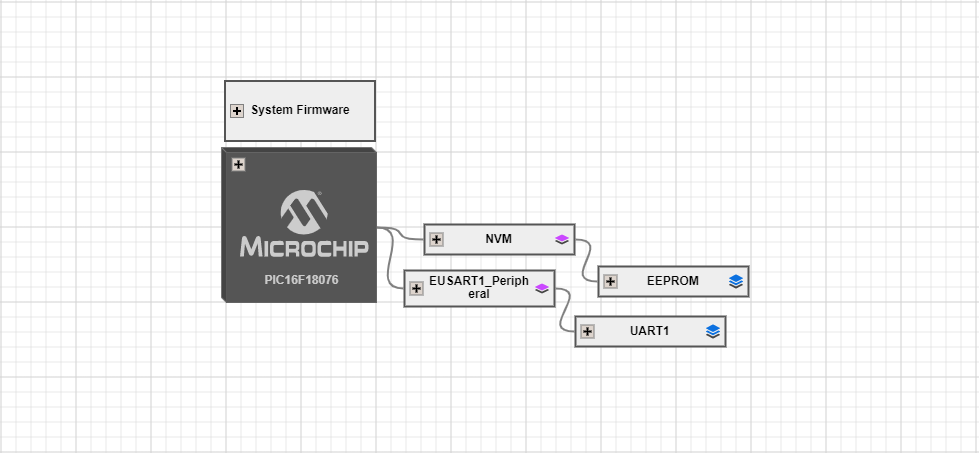
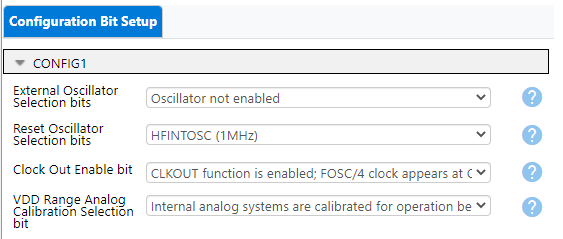
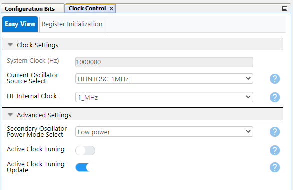
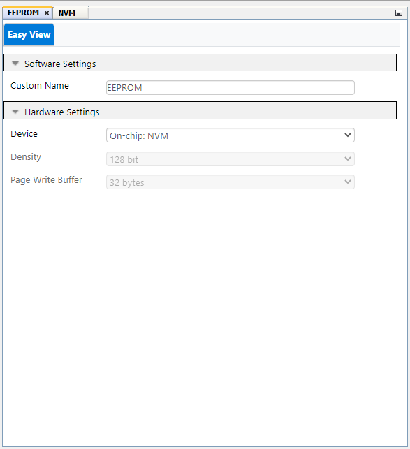
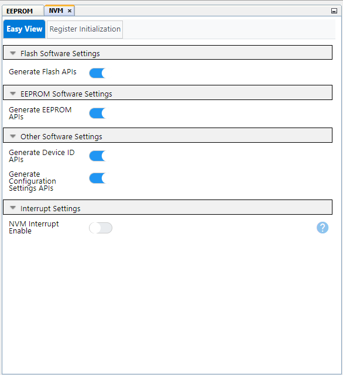
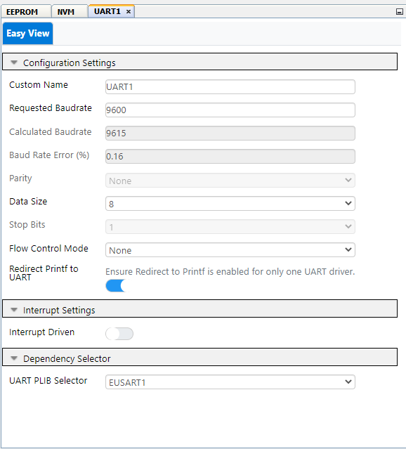
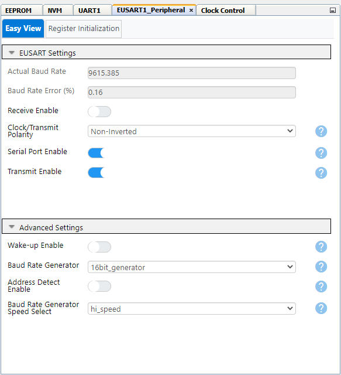
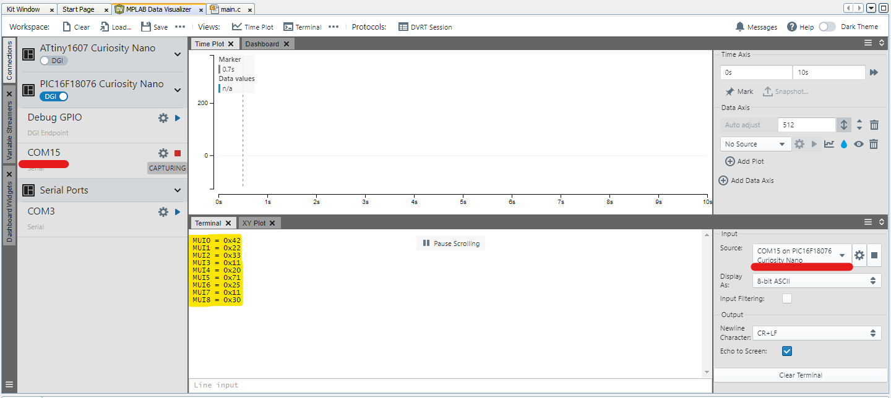

# Unique-Identifier-PIC16-Demo

# Reading the Microchip Unique Identifier (MUI) on the PIC16 family of devices

This code example uses the memory driver generated using the Melody library to read the MUI number from the microcontroller's memory. The MUI is a unique number that is encoded individually during final manufacturing  on every device. This allows for unique device tracking by the application manufacturer.

## Related Documentation

  - [PIC16F18076 Family Product Page](https://www.microchip.com/en-us/products/microcontrollers-and-microprocessors/8-bit-mcus/pic-mcus/pic16f18076)
  - [PIC16F18076 Datasheet](https://ww1.microchip.com/downloads/aemDocuments/documents/MCU08/ProductDocuments/DataSheets/PIC16F18056-76-28-40-Pin-Microcontroller-Data-Sheet-40002325B.pdf)
  - [PIC16F18076 Curiosity Nano User Guide](https://ww1.microchip.com/downloads/aemDocuments/documents/MCU08/ProductDocuments/UserGuides/PIC16F18076-CuriosityNano-HW-UserGuide-DS50003399.pdf)

## Software Used

- [MPLAB® X IDE 6.10](https://www.microchip.com/en-us/development-tools-tools-and-software/mplab-x-ide) or newer
- [MPLAB® XC8 2.41](https://www.microchip.com/en-us/development-tools-tools-and-software/mplab-xc-compilers) or newer compiler
- [MPLAB® Code Configurator (MCC) 6.3.7](https://www.microchip.com/mplab/mplab-code-configurator) or newer 
- [Microchip PIC16F1xxxx_DFP Device Support (1.18.352) ](https://packs.download.microchip.com/) or newer
- [MCC Melody Core 5.5.7](https://www.microchip.com/en-us/tools-resources/configure/mplab-code-configurator/melody) or newer
## Hardware Used

- PIC16F18076 Curiosity Nano ([EV53Z50A](https://www.microchip.com/en-us/development-tool/EV53Z50A))

## Setup

The PIC16F18076 Curiosity Nano Development Board is used as the test platform. This board has an onboard programmer/debugger and is equipped with a virtual serial port.

The following configurations must be made for this project:

| Pin | Configuration            |
| :-: | :-----------------------:|
| RB4 | UART TX pin              |
| RA1 | Digital output for LED   |
| RA0 | Digital input for Switch |

## MCC Settings:
 

This application uses the Memory and the UART drivers. The following screenshots illustrate the settings from MCC.

### System & Clock Settings

 

*Because of how the PIC16F18076 is set up you may need to check if this step is optional for you. This step is taken because the default clock of the pic is set as an external clock meaning your device may not have a clock on start-up.

 

### Memory Module

 

 

### UART Module
 
 

## Operation

When the curiosity nano board is programmed, the firmware reads the MUI and stores it in an array. Every time the push button (SW0) is pressed, the MUI is printed on the UART which can be observed on the MPLAB Data Visualizer. The LED state toggles every time the push button is pressed for visual confirmation.

 

## Summary

This project demonstrates how to read the MUI from the device's memory and display it using the UART module and the MPLAB Data Visualizer. The MUI is helpful with uniquely identifying the device in a given application.

